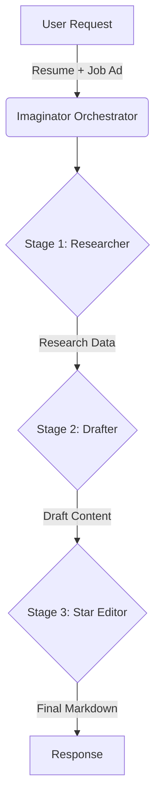

# Job Ad Data Processing Flow (3-Stage Pipeline)

This document describes the data processing flow for the Imaginator 3-Stage Pipeline (Researcher → Drafter → StarEditor).

## Overview

The pipeline transforms a user's resume and a target job advertisement into a highly tailored, ATS-optimized resume section using a 3-stage LLM approach.

## Pipeline Architecture

### Stage 1: Researcher (Perplexity Sonar Pro)

**Goal:** Extract critical information and domain context.

- **Input:** Job Advertisement, User Experiences (parsed).
- **Process:**
  - Performs grounded search to understand company context and domain terms.
  - Extracts "hard" and "soft" skills, domain vocabulary, and implied metrics.
- **Output:** Structured research data (JSON).

### Stage 2: Drafter (Xiaomi MiMo v2 Flash)

**Goal:** Draft the content using STAR (Situation, Task, Action, Result) method.

- **Input:** Researcher Output, Job Ad, Resume.
- **Process:**
  - Selects the best matching experiences.
  - Rewrites bullet points to align with job requirements.
  - Incorporates domain keywords and metrics.
- **Output:** Drafted bullet points (Markdown).

### Stage 3: Star Editor (Google Gemini 2.0 Flash)

**Goal:** Polish, format, and optimize for ATS.

- **Input:** Drafter Output.
- **Process:**
  - Refines tone and clarity.
  - Formats as clean Markdown.
  - Performs final ATS keyword check.
- **Output:** Final polished resume section (Markdown).

## Data Flow Diagram



## API Endpoint

**POST** `/analyze`

**Request Payload:**

```json
{
  "resume_text": "...",
  "job_ad": "...",
  "extracted_skills_json": {...} // Optional
}
```

**Response Payload:**

```json
{
  "final_written_section_markdown": "...",
  "processing_status": "completed",
  "run_metrics": {...}
}
```
