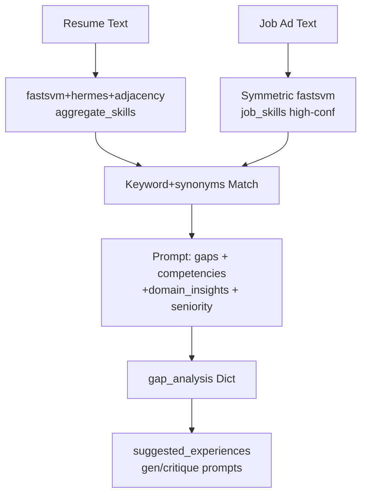

# Enhanced Gap Analysis Feature PRD
## Product Requirements Document

**Version**: 1.0  
**Date**: 2025-12-13  
**Author**: Roo Architect  
**Status**: Draft for Review  

### 1. Overview
The Imaginator Resume Co-Writer currently provides basic heuristic-based gap analysis between resume skills and job requirements. This PRD defines enhancements to make gap analysis semantic, structured, and deeply integrated with the existing pipeline modules (fastsvm, hermes, loader, adjacency graphs).

**Scope**: Update analysis stage in [`imaginator_flow.py`](imaginator_flow.py) to produce richer `gap_analysis` (Dict) in [`AnalysisResponse`](models.py:132), propagating to `suggested_experiences` and downstream stages.

**Out of Scope**: UI changes, new endpoints, breaking schema changes (str fallback preserved).

### 2. Goals & Objectives
- **Primary**: Produce prioritized, actionable skill gaps with bridging suggestions.
- **Secondary**: Leverage all pipeline inputs for context-aware analysis.
- **Metrics-Driven**: Improve gap accuracy (test coverage +80%), reduce false negatives.

### 3. Current State & Limitations
Current: Keyword heuristic (lines 1352-1437 [`imaginator_flow.py`](imaginator_flow.py)):
- Hardcoded `required_keywords`.
- Symmetric extraction absent for job_ad.
- No semantics/confidence weighting.
- Underuses: competencies, domain_insights.skill_gap_priority, seniority.

**Issues**:
- Misses niche skills.
- Binary gaps (critical only).
- Poor propagation (tested in [`test_gap_propagation.py`](tests/test_gap_propagation.py)).

### 4. Proposed Solution
Hybrid: Heuristic → LLM refinement.



### 5. Functional Requirements
- **FR1**: Extract `job_skills` (List[str], conf>0.7) from job_ad using fastsvm_process_resume.
- **FR2**: Compute heuristic_gaps = set(job_skills) - candidate_skills (weighted).
- **FR3**: LLM call: Input gaps + processed_skills + competencies + domain_insights → Output structured gaps.
- **FR4**: Structured `gap_analysis`:
  ```json
  {
    \"critical_gaps\": [{\"skill\": \"Kubernetes\", \"severity\": \"high\", \"evidence\": \"job req 3x\"}],
    \"medium_gaps\": [...],
    \"nice_to_have\": [...],
    \"bridging_strategies\": [{\"gap\": \"Kubernetes\", \"suggestion\": \"Add ECS project bullet\"}],
    \"overall_summary\": \"string\"
  }
  ```
- **FR5**: Fallback: Current heuristic as JSON str if LLM fails.

### 6. Technical Requirements
- **Backward Compatible**: `gap_analysis: Union[str, Dict]` (models.py).
- **Config Flags**: `ENABLE_SEMANTIC_GAPS` (default true).
- **Prompt Template**: In imaginator_flow.py, post-heuristic.
- **Cost**: +1 LLM call (~$0.02), cacheable.
- **Tests**: Extend test_gap_propagation.py for new fields.

### 7. Integration Points
| Module | Input | Usage |
|--------|--------|--------|
| fastsvm | job_ad | job_skills extraction |
| hermes | job_ad | job_insights |
| skill_adjacency.json | candidate_skills | reverse for bridging |
| verb_competency.json | experiences | leadership gaps |
| domain_insights | priority | weight gaps |
| seniority_detector | level | adjust expectations |

### 8. Schema Changes
- Enhance `gap_analysis` docs in models.py: \"Structured gaps or legacy string\".
- Update API_REFERENCE.md example to show Dict.
- No required fields change.

### 9. Success Metrics
- **Quantitative**: 90% test pass rate, gap_recall >80% (golden_dataset).
- **Qualitative**: Structured gaps in 100% responses.
- **Observability**: run_metrics.calls label \"gap_llm\".

### 10. Risks & Mitigations
| Risk | Mitigation |
|------|------------|
| LLM hallucination | Ground prompt with exact skills lists |
| Cost increase | Cache heuristic, optional flag |
| Service deps fail | Fallback to current |
| Schema breakage | Union type, versioned |

### Appendix: Sample Output
```json
{
  \"gap_analysis\": {
    \"critical_gaps\": [{\"skill\": \"Kubernetes\", \"impact\": 0.85}],
    ...
  }
}
```

**Next**: Implement in code mode.